<h1 id="Home"> <strong> 🥁 HanMus3D 🎸 </strong> </h1>

Bienvenue dans le dépôt du projet HanMus3D, une application de Réalité Virtuelle pour l'expression artistique. En espérant que vous aimerez ce projet !

EDIT : Je n'ai pas pu déposer le code du projet dans ce repertoire publique, mais vous pouvez consulter la video de démontration : [https://www.youtube.com/watch?app=desktop&v=LYnrml6dVZ8](https://www.youtube.com/watch?app=desktop&v=LYnrml6dVZ8)

<h2 id="Sommaire"> <strong> 🌍 Sommaire </strong> </h2>

* [**0 - Sommaire**](#Sommaire)
* [**1 - Contenu**](#Contenu)
* [**2 - Description**](#Description)
  * [**a - Contexte**](#contexte)
  * [**b - Remerciements**](#remerciements)
  * [**c - Énoncé**](#enonce)
  * [**d - Travail effectué**](#travail)
* [**3 - Installations**](#Installations)
    * [**a - Godot**](#godot)
    * [**b - PureData**](#puredata)
    * [**c - Addons**](#addons)
    * [**d - Export Android**](#android)
* [**4 - Utilisation**](#Utilisation)
  * [**a - Application Godot**](#appliGodot)
  * [**b - Application PureData**](#appliPureData)
  * [**c - Expérience Utilisateur**](#xpperso)
  * [**d - Modifications**](#modifications)
* [**5 - Fonctionnement**](#Fonctionnement)
  * [**a - Ivmi Nodes**](#ivmi)
  * [**b - La manette**](#manette)
  * [**c - La connexion**](#connexion)
* [**6 - Ouvertures**](#Ouvertures)
  * [**a - Prototypes**](#proto)
  * [**b - Tracking**](#tracking)
  * [**c - Interactions**](#interactions)
  * [**d - Système Embarqué**](#embarqué)

---

<h2 id="Contenu"> <strong>📂 1 - Contenu <a href="#Home">⬆</a> </strong> </h2>

---

* [**Appli-godot3**](./Appli-godot3/) : Application Godot VR pour HanMus3D
* [**Appli-godot4**](./Appli-godot4/) : Tests de programmation en godot4
* [**Appli-puredata**](./Appli-puredata/) : Application PureData pour HanMus3D
* [**Articles**](./Articles/) :  Liste des Articles Scientifiques ayant inspiré ce projet
* [**Data**](./Data/) : Images utilisées pour ce compte rendu
* [**.gitignore**](\.gitignore) : Fichier utile pour ignorer les fichiers inutiles
* [**README.md**](./README.md) : Le fichier que vous lisez 

---

<h2 id="Description"> <strong>📜 2 - Description <a href="#Home">⬆</a></strong> </h2>

---

<h3 id="contexte"> <strong>2.a - Contexte <a href="#Description">⬆</a></strong> </h3>

Ce projet correspond au [Projet de Fin d'Etudes](https://portail.fil.univ-lille.fr/portail/index.php?dipl=MInfo&sem=RVA&ue=PFE&label=Pr%C3%A9sentation) (PFE) d'[Antoine NOLLET](mailto:antoine.nollet.etu@univ-lille.fr), encadré par [Florent BERTHAUT](mailto:florent.berthaut@univ-lille.fr) et [Thomas PIETRZAK](mailto:thomas.pietrzak@univ-lille.fr). 

Le PFE était une Unité d'Enseignement (UE) dispensé dans le cadre du [Master 2 Sciences et Technologies mention Informatique](https://portail.fil.univ-lille.fr/portail/index.php?dipl=MInfo&label=Pr%C3%A9sentation) (M2 INFO) de l'[Université de Lille](https://www.univ-lille.fr/). Le responsable de cette UE PFE était [Cédric DUMOULIN](mailto:cedric.dumoulin@univ-lille.fr). Cette UE a eu lieu de Janvier 2023 à Mars 2023.

Antoine Nollet était ainsi étudiant du M2 INFO [parcours Réalité Virtuelle et Augmentée](https://portail.fil.univ-lille.fr/portail/index.php?dipl=MInfo&sem=RVA&ue=ACCUEIL&label=Pr%C3%A9sentation) (RVA) durant l'année scolaire 2022-2023.

Florent Berthaut est chercheur dans l'équipe de Recherche [Mint](https://mint.univ-lille.fr/) du [Centre de Recherche en Informatique, Signal et Automatique de Lille](https://www.cristal.univ-lille.fr/spip.php?page=rubrique&id_rubrique=1) (CRIStAL).

Thomas Pietrzak est chercheur dans l'équipe de Recherche [Loki](https://loki.lille.inria.fr/) du Centre de Recherche [INRIA](https://www.inria.fr/fr/centre-inria-de-luniversite-de-lille) de Lille.

---

<h3 id="remerciements"> <strong>2.b - Remerciements <a href="#Description">⬆</a></strong> </h3>

Je tiens à remercier ma formation de m'avoir permis d'entreprendre un tel projet qui a été pour moi source s'enrichissement et d'épanouissement dans l'exercice de mon travail dans des domaines qui me passionnent : la recherche et la musique ! J'ai eu l'impression de travailler et de m'amuser et ceci dans le même temps, impression que je souhaite à tout le monde de connaître ! 

Lors des 2 mois que j'ai passé à travailler sur ce projet, on m'a donné l'accès à un bureau au sein du laboratoire de l'[IRCICA](https://ircica.univ-lille.fr/fr/linstitut) dans lequel j'ai pu travailler à mon rythme et dans les meilleures conditions, raison pour laquelle j'aimerai remercier l'IRCICA. Le matériel qui a été mis à ma disposition était de qualité et sans quoi je n'aurais pu aboutir aux travaux que j'ai effectué.

Le personnel en charge de l'accueil et des accès des bâtiments ont notamment su me démontrer leur confiance en me confiant un badge et une clé me permettant de me rendre à mon bureau. Ils ont toujours su faire preuve de bienveillance à mon égard et c'est la raison pour laquelle je les remercie chaleureusement.

Anisse, dont je n'ai malheureusement pas le nom de famille, m'a aidé en bricolage et électronique là où mon experience faisait défaut. Il a toujours été très prévenant envers moi et m'a aidé dans mes projets même s'il n'y était pas affilié, je lui suis reconnaissant de l'aide qu'il m'a apporté ! 

M.Pietrzak, encadrant de ce projet et responsable du parcours RVA du master INFO, a su m'apporter des conseils pertinents dans l'élaboration de mon projet et dans mon projet professionnel. Il a toujours été un soutien sur lequel il m'était possible de compter et je l'en remercie fortement.

Bien que je sois loufoque comme individu, il ne m'arrive pas d'avoir de conversation avec moi-même ! J'aimerai remercier tout mes camarades de promo qui ont partager le local où se trouvait mon bureau. Ils ont été présents à mes côtés tout le long du projet même s'ils travaillaient sur les leurs, pouvoir discuter avec eux me permettait d'avoir davantage de recul dans mes réflexions et de me sentir bien entouré ! Esther, Martin, Luka, Mohammad, Amelys et Thibaut, merci à vous les amis, sans vous je n'aurais pas eu une si bonne première expérience de labo ! 

Enfin, je voudrais remercier M.Berthaut pour tout le soutien, la patience et la prévenance dont il a fait preuve à mon égard. Il a su croire en moi lorsque je ne le savais pas moi-même ! Son implication passionné pour le projet était très encourageante ! Ce fût d'ailleurs rassurant d'avoir un chercheur aussi fantaisiste et bienveillant en tant qu'encadrant, ça donne envie de partir dans la recherche si cela permet de s'amuser à concrétiser des idées dans tout les sens et de réaliser ses passions ! 

---

<h3 id="enonce"> <strong>2.c - Énoncé <a href="#Description">⬆</a></strong> </h3>

L’objectif de ce projet était d’explorer l’adaptation des dispositifs et techniques d'interaction 3D pour la réalité virtuelle et augmentée aux spécificités des applications expressives, en particulier l'interaction musicale. Les dispositifs et techniques pour la sélection 3D se limitent en effet souvent à des objectifs d'efficacité en temps et précision. Ce projet consistera en la conception d'un dispositif attaché à la main et de techniques de sélection 3D permettant de sélectionner avec plusieurs doigts des accords d'objets musicaux ou différentes parties d’une même structure musicale. Ces éléments musicaux pourront ensuite être activés pour chaque doigt à l'aide de capteurs de vibration placés sur le dispositif, qui donneront un contrôle fin et expressif. Le dispositif sera combiné à un casque de réalité virtuelle, et les techniques seront implémentées dans le logiciel Godot. Le dispositif et techniques mises au point seront évaluées avec des musiciens.

* Mettre au point au moins un prototype de dispositif avec capteurs piezos
* Concevoir plusieurs techniques de sélection 3D multiples (par doigt)
* Évaluer les techniques et dispositifs par mesures de rendu sonore et par une étude avec musiciens

--- 

<h3 id="travail"> <strong>2.d - Travail effectué <a href="#Description">⬆</a></strong> </h3>

Ce projet a été l'occasion de :

* Lire divers références scientifiques dans le domaine dans lequel le projet se posait
* Concevoir deux prototypes de manettes
* Concevoir une application Godot de Réalité Virtuelle (RV) qui utilise les librairies [Ivmi-Builder](https://gitlab.univ-lille.fr/ivmi/ivmi-builder) et [Godot OpenXR](https://docs.godotengine.org/fr/stable/tutorials/vr/openxr/index.html)
* S'initier au logiciel [PureData](https://puredata.info/) et manipuler une application PureData
* S'initier aux systèmes embarqués avec une carte [Bella Mini Multi-channel](https://learn.bela.io/products/multichannel/bela-mini-multichannel-expander/)

Voici les deux prototypes : 

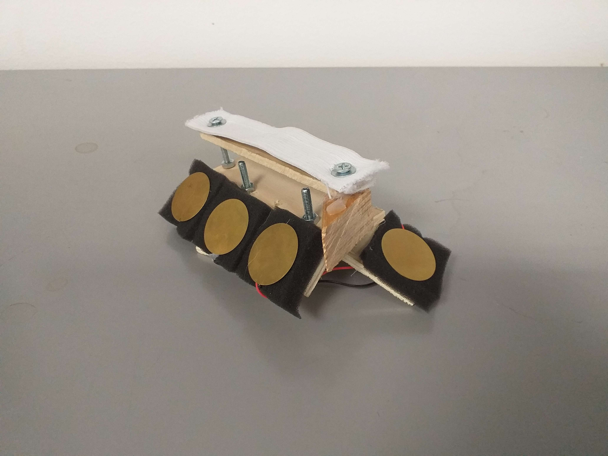</img>
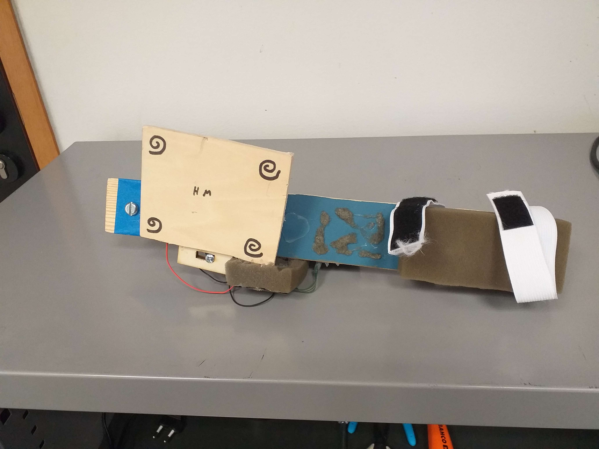</img>

Seule une technique a au final été implémentée, le cône de sélection :

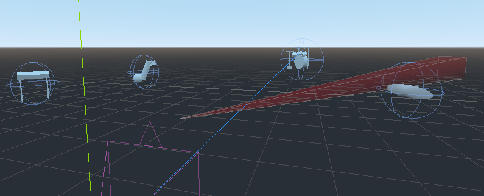</img>

Vous pourrez visionner une démo d'utilisation du 2e prototype via le lien suivant : à venir

> Ce projet aspire à contribuer au projet MultiTouchVR du groupe Mint, dans son principe de "frotter" les sons dans une application RV.

---

<h2 id="Installations"> <strong>💻 3 - Installations <a href="#Home">⬆</a></strong> </h2>

---

<h3 id="godot"> <strong> 3.a Godot <a href="#Installations">⬆</a></strong> </h3>

Pour lancer l'application de réalité mixte HanMus3D, il vous faudra avoir installé le moteur de jeu Godot via ce lien : [https://godotengine.org/](https://godotengine.org/). En l'état, l'application fonctionne sur Godot3 et non sur Godot4, veillez à installer Godot3 pour pouvoir lancer l'application.

---

<h3 id="puredata"> <strong> 3.b PureData <a href="#Installations">⬆</a></strong> </h3>

L'application godot HanMus3D communique un script PureData qui s'éxecute en parallèle, il vous faudra donc avoir installé le logiciel PureData via ce lien : [https://puredata.info/downloads/pure-data](https://puredata.info/downloads/pure-data)

---

<h3 id="addons"> <strong> 3.c Addons <a href="#Installations">⬆</a></strong> </h3>

Il est attendu plusieurs dépôts git à cloner pour que l'application puisse s'éxecuter. Depuis un inviter de commande positionné d'abord dans le dossier [Appli-godot3/addons](./Appli-godot3/addons/) puis dans le dossier [Appli-puredata/addons](./Appli-godot3/addons/), lancez la commande suivante (il faut donc lancer deux fois la même commande dans deux dossiers différents) :

    git clone https://gitlab.univ-lille.fr/ivmi/ivmi-builder.git;

Au haut et au milieu de la fenêtre de base de Godot, accédez à AssetLib et cherchez y **"OpenXR Plugin"**. Cliquez sur télécharger, le dossier correspondant s'installera dans le dossier addons

---

<h3 id="android"> <strong> 3.d Export Android <a href="#Installations">⬆</a></strong> </h3>

Si vous souhaitez exporter l'appli sur un casque VR embarqué (comme par exemple le Quest 2), vous devrez tout d'abord avoir installé OpenJDK via ce lien : [https://adoptium.net/temurin/releases/?version=11](https://adoptium.net/temurin/releases/?version=11)

Il vous faudra ajouter à votre variable d'environnement système PATH le dossier bin de votre OpenJDK. Vérifiez que cela est en ordre en tapant la commande suivante sur un invité de commande :

    java -version

Si votre version de java n'est pas affichée, soit il vous faut reprendre l'installation de OpenJDK, soit correctement modifier votre variable d'environnement système PATH.

Ensuite, il vous faudra avoir installé le SDK Android en installant android studio via ce lien : [https://developer.android.com/studio](https://developer.android.com/studio)

Une fois installé, il vous faudra vérifier dans votre SDK Manager (lancer Android Studio -> cliquer sur "More Actions" -> cliquer sur "SDK Manager") si vous avez installé ces packages :

* Android SDK Platform-Tools version 30.0.5 ou supérieure

* Android SDK Build-Tools version 30.0.3

* CMake version 3.10.2.4988404

* NDK version r23c (23.2.8568313)

Enfin, depuis Godot, cliquer sur Éditeur->Paramètres de l'éditeur. Aller dans Export->Android pour entrer vos Android SDK Path et Debug Keystore.

Pour connaître votre Android SDK Path, lancer le SDK Manager depuis Android studio, il sera affiché vers le haut de la fenêtre, il vous suffira de le copier coller dans le champ de saisie dédié dans votre fenêtre Godot.

Pour accéder à votre fichier debug.keystore, diriger vous là où vous avez installé votre OpenJDK, dans le dossier /bin. Executez la commande suivante : 

    ./keytool.exe -keyalg RSA -genkeypair -alias androiddebugkey -keypass android -keystore ../../../Users/Mint/Downloads/debug.keystore -storepass android -dname "CN=Android Debug,O=Android,C=US" -validity 9999 -deststoretype pkcs12

Cette commande générera votre fichier debug.keystore. Placez le à l'emplacement de votre choix. Vous pourrez ensuite copier coller le chemin du fichier dans le champ de saisie dédié dans votre fenêtre Godot.

---

<h2 id="Utilisation"> <strong> 💃 4 - Utilisation  <a href="#Home">⬆</a></strong> </h2>

---

<h3 id="appliGodot"> <strong> 4.a Application Godot <a href="#Utilisation">⬆</a></strong> </h3>

L'application HanMus3D est tout d'abord une application de réalité virtuelle. Elle a été implémenté avec le logiciel Godot. Dans le cas de son utilisation, 2 types de casques ont été testés : le Quest 2 et le Varjo XR-3.

Il est à noté que pour le bon fonctionnement global de l'application, le casque doit soit être directement branché sur le pc qui exécute l'application soit être connecté au même réseau que le pc qui éxecute l'application PureData.

[L'application](Appli-godot3/project.godot) peut être lancée depuis le logiciel Godot, il vous suffit de cliquer sur la flèche en haut à droite (il faudra un casque RV connecté). Vous pouvez également, lorsque cela est proposé, de cliquer sur l'icone android, cela installera l'application dans votre appareil.

Lorsque l'application est installé dans un casque embarqué, vous pouvez la lancer depuis ce même casque. Il vous faudra simplement le connecter au même réseau que le pc qui lancera l'application PureData.

---

<h3 id="appliPureData"> <strong> 4.b Application PureData <a href="#Utilisation">⬆</a></strong> </h3>

En parallèle de l'application RV, il vous faudra également lancer l'[application PureData](./Appli-puredata/). Sans elle vous n'aurez simplement pas de sons suite à votre expérience utilisateur.

---

<h3 id="xpperso"> <strong> 4.c Expérience Utilisateur <a href="#Utilisation">⬆</a></strong> </h3>

Il vous faudra brancher la manette directement sur le pc sur lequel vous lancez l'application PureData. Lorsque l'application PureData réagi aux capteurs de la manette, elle est en effet bien connectée.

L'application consistera ensuite à utiliser votre main ou vos mains pour sélectionner des surfaces dans l'espace :

</img>

Avec la technique du cône de sélection, les mains permettent de diriger une zone en forme de cône qui pourra entrer en collision avec des surfaces qui sont ici des sphères. Selon la position de collision entre une surface et le cône, l'interaction musicale en sera changé :

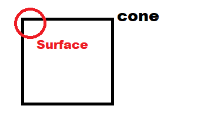</img>

En effet, lorsque vous collisionnez le cône avec une surface, vous allez pouvoir frotter la plaque de la manette pour produire du son. Pensez donc à activer le son de votre pc ! Dans l'exemple du cas ci-dessus, la surface a collisionné le cône sur son côté haut-gauche. Le cône fait un parallèle direct avec la plaque de la manette. La surface se trouve en haut à gauche du cône, alors il faudra frotter le côté haut-gauche de la plaque pour produire un son.

De plus, en éloignant ou en rapprochant votre main, vous pourrez affiner votre sélection en aggrandissant ou en réduisant le volume du cône, sélectionnant ainsi soit moins de surface soit davantage de surface. Sélectionner plus ou moins de surfaces différentes permettra de jouer plus ou moins de sons. Chaque surface a un son associé qu'il sera possible de jouer via frottements de la plaque.  

La manette est muni d'un capteur de pression qui aura le rôle de click. Lors d'un click quand des surfaces sont sélectionnées, il est possible de les manipuler, de les déplacer. Déplacer ces surfaces est une intéraction nécessaire à l'application car sinon l'utilisateur ne pourrait pas pleinement disposer ses intruments comme il le souhaite et cela contraindrait l'expression musicale de l'application.

---

<h3 id="modifications"> <strong> 4.d Modifications <a href="#Utilisation">⬆</a></strong> </h3>

Il est possible que vous souhaitiez :

* ajouter une ou plusieurs techniques de sélection
* ajouter des surfaces avec des sons spécifiques
* ajouter un nouveau type de manette

Pour le premier point, il est principalement question de programmation via le logiciel Godot. La plupart du code implémenté se trouve dans le fichier [Hand.gd](./appli-godot3/src/Hand.gd). Je vous conseille néanmoins de regarder avec attention tout les éléments de la scène. Ils seront notamment explicité dans la partie suivante. Le code permet assez facilement l'ajout de technique d'intéraction, en voici les étapes primordiales :

- ajouter les élements pour votre sélection (mesh et collision shape) dans les scènes des mains (si elles se basent sur la position des mains, sinon ajoutez les là cela est pertinent)
- initialisez là dans la fonction _ready() et déclarer la dans l'enum SELECTION
- définissez son comportement (par exemple mouvements) que vous appelerez dans la fonction _process(), comme ceci : 

        ...
        # si le controller est visible, mettre la technique de sélection courante en oeuvre
	    if controller.visible:
		    if selection_mode == SELECTION.CONE:
			    process_cone_selection()
            elif selection_mode == SELECTION.NEWTECHNIQUE:
                new_comportement() # votre nouvelle technique de sélection
        ...
- définissez ses collisions dans la fonction _physics_process comme ceci :

        # Appelé à chaque interaction physique, idéal pour les gestions de collisions
        func _physics_process(delta):
	    # Gestion de collisions seulement si il y a suivi de la main
	    if controller.visible:
		# si selection par cone et que ce cone est visible
		if selection_mode == SELECTION.CONE and selection_cone.visible:
			results = coneArea.get_overlapping_bodies()
        elif selection_mode == SELECTION.NEWTECHNIQUE and validnewselection():
            results = nouvelles_collisions() # tableaux de staticsbodies attachés à des surfaces
- potentiellement modifier process_surface() si vos envoies de properties (expliqué dans la partie suivante) sont trop différents de ceux présents

Lorsque vous programmerez, un écran de debug peut être remis à visible et vous pouvez y effectuer vos prints de test. Il y a également une instance boule qui vous permettra de tester vos calculs de positions.

Pour le second point, il vous faudra ajouter un noeud de scène contenant un staticbody pour les collisions et à qui il sera attaché le script [Surface.gd](appli-godot3/src/Surface.gd). Il vous faudra rajouter votre son (.wav) dans le dossier [sounds](appli-puredata/sounds/). Ensuite il vous faudra modifier le fichier [_main.pd](Appli-puredata/_main.pd) de l'application puredata.

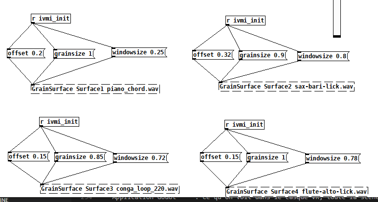</img>

Il vous faudra faire un ctrl+e pour pouvoir éditer. Vous pouvez ensuite copier-coller en sélectionnant un des quatres schémas présentés ci-dessus et en faisant un ctrl+c puis un ctrl+v. Enfin en cliquant sur le carré inférieur de votre nouveau schéma, vous pouvez modifier le nom du milieu avec le nom de la surface, du noeud, que vous avez ajouté. Vous pouvez aussi changer le nom du fichier son associé pour y mettre le nom de votre fichier son.

Enfin, pour le troisième point, il vous faudra concevoir une nouvelle manette qui envoie 4 signaux électriques : les haut-gauche/droite et les bas-gauche/droite. Ensuite, il faudra connecter ces signaux à la carte Bella.

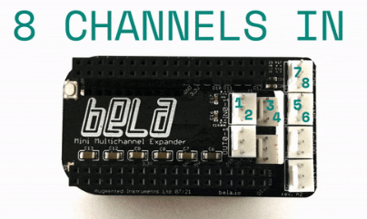</img>

Pour connaître exactement les branchements de la carte Bella Mini Multi-channel, vous pouvez la brancher à votre ordinateur et vous rendre à l'adresse [http://bela.local](http://bela.local), [http://192.168.6.2/](http://192.168.6.2/) ou [http://192.168.7.2/](http://192.168.7.2/). Vous pourrez y voir depuis l'interface web les différents noms de branchements. 

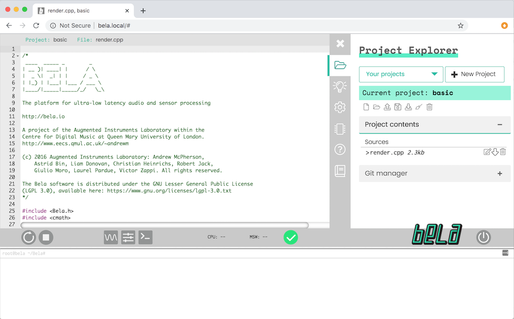</img>

Une fois les informations obtenues et les câblages effectués, vous allez pouvoir modifier le script [_main.pd](Appli-puredata/_main.pd) :

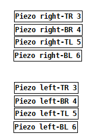</img>

Vous pourrez y indiquez les numéro adc~ des entrées utilisées par votre manette. Cependant vous allez devoir modifier également la partie suivante :

</img>

En effet, en modifiant les numéros d'entrées à lire, vous devrez réuploader les fichiers puredata ([_main.pd](Appli-puredata/_main.pd) et le contenu du dossier [src](Appli-puredata/src/)) dans la carte Bella depuis l'IDE web. Avant le faire, il faudra enlever le lien entre loadbang et receive pour en créer un nouveau entre loadbang et send. Cliquer sur un lien et taper sur la touche suppr pour la supprimer, cliquer d'un bord noir d'une case à l'autre pour les relier. Une fois le lien changé, vous pouvez les uploader dans la carte. Enfin, vous pourrez annuler ce changement de lien sur la version de _main.pd qui restera sur votre ordinateur, la raison sera expliqué dans la prochaine partie.

---

<h2 id="Fonctionnement"> <strong> 🛠 5 - Fonctionnement <a href="#Home">⬆</a></strong> </h2>

L'application est donc divisé en 3 couches : 

* Application Godot     : Ce qu'on voit dans le casque VR, toute la scène 3D
* Application PureData  : Lien entre l'application VR et les signaux de la manette
* Carte Bella           : Envoie de signaux des capteurs piezos et du capteur de pression

Les 3 couches sont en communication tout le long de l'utilisation de l'application HanMus3D.

---

<h3 id="ivmi"> <strong> 5.a Ivmi Nodes <a href="#Fonctionnement">⬆</a></strong> </h3>

Comme expliqué précédemment, les surfaces possédent un script [Surface.gd](Appli-godot3/src/Surface.gd). Les surfaces ainsi que la sélection de l'utilisateur (scripté dans [Hand.gd](appli-godot3/src/Hand.gd)) sont des ivmi-nodes. Toute la scène 3D est elle-même une ivmi-scene.

La particularité de la librairie [Ivmi-Builder](https://gitlab.univ-lille.fr/ivmi/ivmi-builder) est l'envoie d'informations entre une application Godot et une application PureData. Grâce à l'héritage des scripts IvmiNode, il est possible de :

- déclarer une propertie qui pourra ensuite être envoyée ou reçu avec la commande : _add_property("nom_variable", [liste de valeurs])
- recevoir une valeur de propertie dans la redéfinition de la fonction _set_property(prop, vals) (un exemple pour le capteur pression est dans le code)
- envoyer des valeurs de properties avec la commande object.set_property("nom_variable", [nouvelle liste de valeurs])

> attention une propertie doit être déclarée pour être manipulé !

---

<h3 id="manette"> <strong> 5.b La Manette <a href="#Fonctionnement">⬆</a></strong> </h3>

Dans l'énoncé initial du projet, il était question d'une manette attaché à la main et qui aurait des capteurs par doigts. Suite à quoi le 1er prototype a été conçu.

</img>

Cependant il a été constaté que pour l'expression musical, surtout lorsqu'elle est percussive, il y a un intérêt important à pouvoir déplacer le poignet. Ce premier prototype ne permettait pas de pouvoir user de son poignet pour l'expression musicale. Nous avons ainsi été amené à concevoir le 2eme prototype.

</img>

Ce 2eme prototype, attaché à l'avant-bras, permet l'utilisation des poignets pour mieux tapoter les capteurs. Sa plaque a été pensée pour être à la hauteur de la main, qu'on puisse la reposer sur la plaque si l'envie prenait à l'utilisateur. Son capteur de pression devait être facilement d'accès par le pouce, il devait donc se trouver sur le côté de la plaque.

Cependant, il ne fut plus question d'interactions individuelles par doigts, mais d'interactions approximatives à partir d'une plaque. En effet, en tapotant la plaque, plusieurs capteurs piezo sont sollicités en même temps. Selon l'endroit tapoté de la plaque et la position de la surface sélectionnée dans l'appli RV (expliqué en [4.c](#xpperso)) , les sons sortants en sont impactés. Il fut question de reproduire le phénomène de bruit approximatif lorsqu'on tape une percussion, que même en tapant au même endroit, nous n'avons pas forcément le même son.

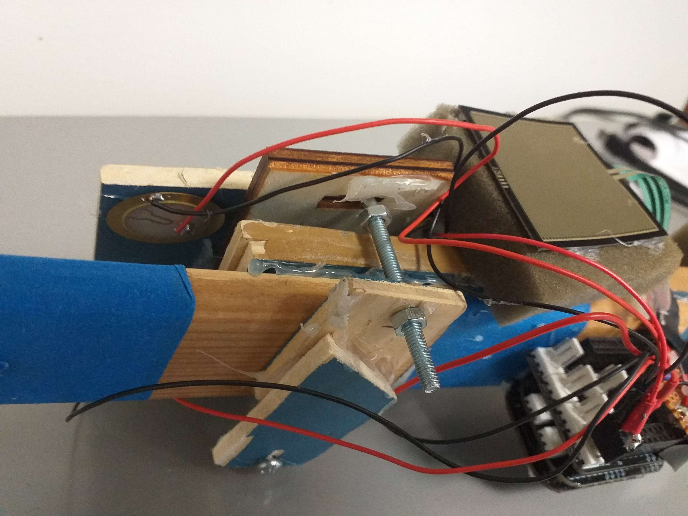</img>

4 capteurs piezo-électriques sont attachés aux 4 coins de la plaque de la manette, ce sont eux qui recevront de la déformation et enverront un signal à la carte Bella lorsque la plaque sera frottée, tapotée par l'utilisateur. Il y a également un capteur pression, nécessaire au click de l'utilisateur. Le capteur est branché à la carte en suivant ce schéma :

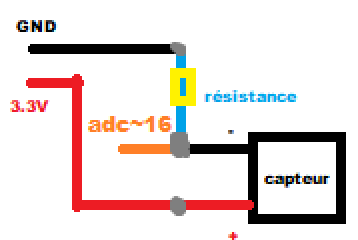</img>

Ces capteurs sont ainsi branchés à la carte [Bella Mini Multi-channel](https://learn.bela.io/products/multichannel/bela-mini-multichannel-expander/) qui est elle même attachée à la manette.

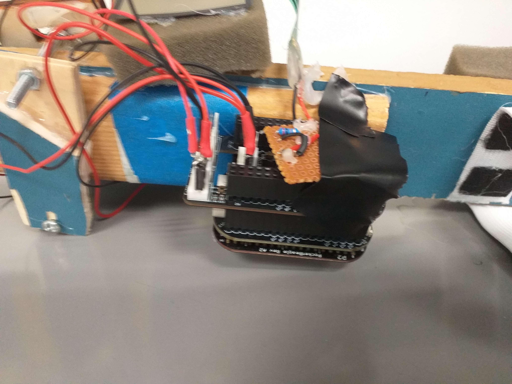</img>

La carte a, comme expliqué briévement dans le dernier point du [4.d](#modifications), un script puredata embarqué. Il s'agit du fichier [_main.pd](Appli-puredata/_main.pd) auquel on change le lien de receive à send accompagné des scripts puredata du dossier [src](Appli-puredata/src/). La carte devra être branchée au pc qui fera tourner l'application puredata, pour être branché en alimentation et pour communiquer avec le script puredata du pc pour jouer les sons.

---

<h3 id="connexion"> <strong> 5.c La connexion <a href="#Fonctionnement">⬆</a></strong> </h3>

Les ivmi properties envoyées depuis le casque RV avec l'application, la carte Bella branchée à l'ordinateur, le script puredata tournera sur l'ordinateur et c'est l'ordinateur qui jouera les différents sons.

En effet, la carte Bella va envoyer au script puredata sur le pc les différentes valeurs des signaux électriques des différents capteurs piezo et de pression. L'application puredata enverra la valeur de pression à l'application RV et celle ci l'interprétera dans l'interaction utilisateur dans le casque RV pour le déplacement des surfaces. L'application puredata recevra également et en plus des valeurs des capteurs piezos de la carte Bella, des valeurs de gains induites par l'interaction utilisateur dans l'application RV par le déplacement du cône de sélection. Ces valeurs de capteurs multipliées par leurs gains de l'application et additionnés, permettront de jouer plus ou moins fort un son sur l'ordinateur. L'application RV enverra les gains adaptés pour que le son joué corresponde à la surface sélectionnée.

---

<h2 id="Ouvertures"> <strong> 🌠 6 - Ouvertures <a href="#Home">⬆</a></strong> </h2>

Le projet a été effectué sur une période assez courte de 2mois, par un étudiant qui apprend toujours et qui a commencé de zéro à développer l'application HanMus3D (même si la librairie Ivmi-builder était déjà existante). En début de projet comme celui ci, il a été naturel de constater des pistes d'améliorations possibles.  

---

<h3 id="proto"> <strong> 6.a Prototypes <a href="#Ouvertures">⬆</a></strong> </h3>

L'élaboration du 2eme prototype a indiqué la nécessité de relier ensemble la plaque avec les capteurs piezos, le capteur pression et la carte Bella. Ils doivent pouvoir être déplacer tout les 3 en même temps et facilement sur le corps de la manette pour pouvoir s'ajuster aux dimensions de l'utilisateur pour ne pas gêner l'utilisation de l'application. Il faudrait d'ailleurs isoler aux vibrations cet ensemble de 3 éléments, ou en tout cas la plaque, du reste de la manette : seul les tapotements et frottements sur la plaque devraient avoir une incidence sur le son joué.

Par soucis matériel, la plaque n'a pas été disposée de manière optimale : elle devrait être centrée à la main. Dans le cas du 2eme prototype on a perdu le potentiel d'utilisation du pouce dans l'expression musicale et ce fut dommage. Cependant le capteur pression doit rester facilement d'accès du pouce, à voir comment ces deux aspects peuvent être respectés simultanément.

Le 2eme prototype a d'ailleurs été la piste d'une réflexion sur l'objectif global du projet. Nous aurions pu vouloir nous rapprocher au maximum d'une "percussion" et "taper" les différents sons. Dans cet objectif là, il faut isoler au maximum raisonnable chacun des capteurs. Si ils ne sont pas assez isolés, en tapant la plaque nous sollicitons tout les capteurs à la même intensité. S'ils le sont trop, on perd l'intérêt de la plaque et devrions simplement faire diverses mini-plaques.

Nous pouvons également nous rapprocher au maximum d'une impression de "caresser" le son (en inspiration de l'article sur [Caress](Articles/Caress.pdf)), ainsi une isolation en vibration entre chacun des capteurs n'est plus nécessaire. Cette piste est certainement la plus intéressante. En tapant la plaque, nous obtenons parfois des sons trop forts et sourds, désagréable dans le cadre de l'utilisation de l'application HanMus3D et de l'expression musicale qu'elle induit.

---

<h3 id="tracking"> <strong> 6.b Tracking <a href="#Ouvertures">⬆</a></strong> </h3>

Un grand problème tout du long du projet fut la position reconnue de la main, qui est bien trop dépendante de la qualité de reconnaissance des mains des différents casques RV. Nous esquivons ce problème en forçant l'utilisateur à avoir les mains faces aux caméras du casque s'il veut correctement diriger son cône de sélection. 

Une approche plus satisfaisante serait de se rapprocher du concept de la manette et non pas de la reconnaissance de la main. Il faudrait se baser sur la position de la manette et pas forcément de la main. Une manière de faire ceci serait d'utiliser un tracker, comme par exemple le [HTC Vive Tracker](https://www.vive.com/fr/accessory/tracker3/). Mais cette approche a été creusé et il s'est avéré que Godot3 ne permettait pas d'utiliser de manière satisfaisante ce type de tracker. Cependant, Godot4 est actuellement sorti depuis peu et semble proposer une gestion de tracker comme le HTC Vive Tracker. Une piste d'amélioration du projet serait de passer tout le projet de Godot3 à Godot4. Un dossier [Appli-godot4](Appli-godot4/) a été débuté pour effectuer des tests sur le potentiel de Godot4.

---

<h3 id="interactions"> <strong> 6.c Interactions <a href="#Ouvertures">⬆</a></strong> </h3>

Un problème qui a perdurer malgré la fin du temps de projet fût la conversion de position de collision en un gain adapté des capteurs piezos. L'idée était d'exprimer les coordonnées de la surface collisionnée selon le repère de la main, qui se veut toujours disposé de la même manière quant on pointe la main dans une direction. Ces coordonnées exprimés en fonction du repére de la main seraient normalisés et le z mis à 0 pour ensuite être utilisé aux calculs des gains. 

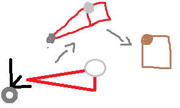</img>

Nous aurions une position p de référence (par exemple le côté haut-gauche serait (0,1,0) et le bas-droit serait (1,0,0)) et une position convertie de la surface ps, le gain au piezo serait calculé ainsi :

$$
gain = max(1 - || p - ps || , 0)
$$

Ainsi, si la surface était considéré comme en haut à gauche, taper la plaque en haut à gauche provoquerait davantage le son de la surface. Bien que cette méthode semble judicieuse, on oublie que même si la main est dirigée dans une direction, un axe de rotation de la main reste libre. Et c'est en bougeant cet axe de rotation qu'on bouge le repère de la main et qu'on perd en pertinence de la conversion de position. Une solution serait de bloquer via script la rotation de cet axe qui nous gêne, cependant le programme de reconnaissance de la main semble empêcher le bloquage de cet axe. Un axe d'approfondissement serait d'en effet passer le projet de Godot3 à Godot4 pour utiliser un tracker et ne plus compter sur l'algorithme de reconnaissance des mains.

Le temps passant, seule une technique d'intéraction a été implémentée. Bien évidemment et comme suggéré dans le premier point de [4.d](#modifications), bien des techniques peuvent implémentées (lancer de rayons, cursors, bubble cursor, etc...) ! Une poursuite du projet pourrait consister à penser de nouvelles techniques.

Les possibilités d'améliorations d'intéractions ne s'arrêtent pas là. On pourrait penser une manière de switcher facilement d'une technique de sélection à une autre (on pourrait même élaborer un protocole d'expérimentation pour tester les différentes techniques dans ce cas d'application). On pourrait également mettre en place des interactions qui modifient la nature même du son joué, en variant ses paramètres puredata par exemple (offset, windowsize, grain, transpose, etc...). Des éléments de scènes peuvent être rajoutés pour favoriser de telles interactions : comme un guitariste utilise une pédale pour changer le son de sa guitare ou comme un pianiste qui change la nature du son de son piano synthétiseur, un click sur un nouveau type de surface changeant les sons pourrait être une piste intéressante. Une inspiration de la [Reactable](https://www.youtube.com/watch?v=Mgy1S8qymx0), par l'influence que des objets peuvent avoir sur le son d'autres objets, peut être également une piste intéressante.

---

<h3 id="embarqué"> <strong> 6.d Système Embarqué <a href="#Ouvertures">⬆</a></strong> </h3>

Nous pourrions imaginer accrocher une batterie et une antenne wifi à la carte Bella afin de ne plus avoir besoin d'utiliser un ordinateur pour l'alimentation et pour la connexion en réseau au casque RV. Il y aurait le problème de la diffusion des sons, mais il peut être prévu de faire jouer les sons par le casque RV lui-même.

---

Merci d'avoir lu ce compte-rendu ! 🔥

Si vous avez la moindre question sur ce projet, n'hésitez pas à me contacter via mon mail :

antoine.nollet@hotmail.fr (comme je ne erai bientôt plus étudiant, me contacter via mon mail personnel vous sera plus efficace pour me contacter)

En vous souhaitant une agréable vie remplie de musiques et de fantaisies ! 🎶
